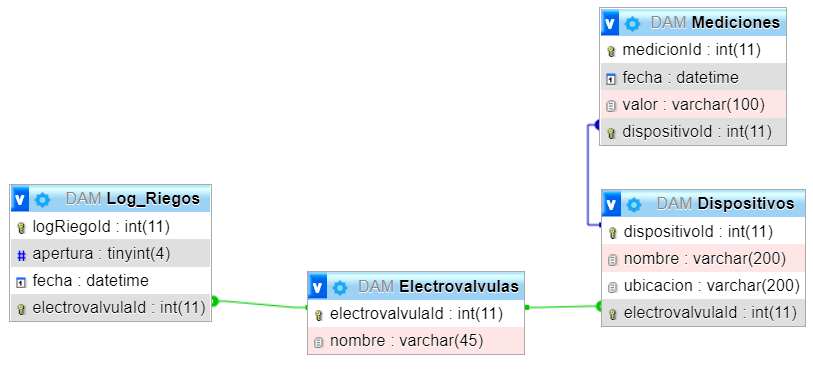
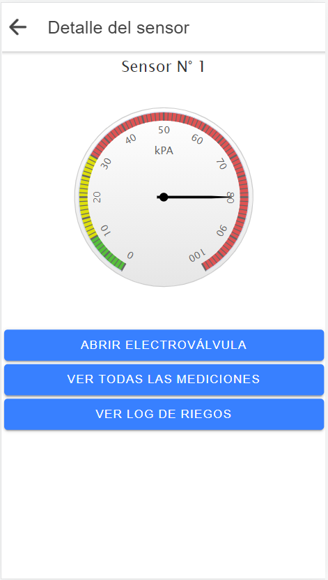
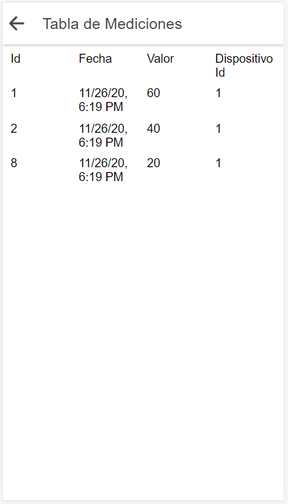
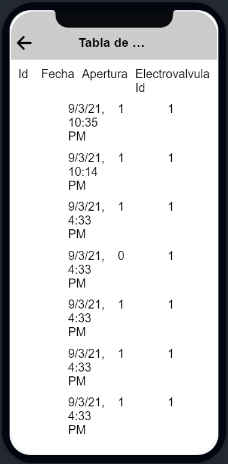

<a href="https://github.com/brianducca/dam">
    
</a>

Desarrollo de aplicaciones multiplataforma
===========================================

Trabajo Práctico Final
Desarrollo de aplicaciones multiplataforma
4ta Cohorte 2021
Autor: Mariano Matias Bustos
Docente: Brian Ducca

## Introducción general
El proyecto consiste en el diseño e implementación de una aplicación para el control de un sistema de riego automatizado. Se aplicaron conceptos vistos durante la cursada de la materia implementando los mismos en el diseño de una aplicacion con el framework Angular utilizando Ionic para darle una adaptabilidad a los dispositivos móviles.

## Comenzando 🚀

Esta sección es una guía con los pasos escenciales para que puedas poner en marcha la aplicación.

<details><summary><b>Mira los pasos necesarios</b></summary><br>

### Descargar el código

Para descargar el código, lo más conveniente es que realices un `fork` de este proyecto a tu cuenta personal haciendo click en [este link](https://github.com/marianobustos/DAM-TP-FINAL-BUSTOS/fork). Una vez que ya tengas el fork a tu cuenta, descargalo con este comando (acordate de poner tu usuario en el link):

```
git clone https://github.com/USER/DAM-TP-FINAL-BUSTOS.git
```

> En caso que no tengas una cuenta en Github podes clonar directamente este repo.

```
git clone https://github.com/marianobustos/DAM-TP-FINAL-BUSTOS.git
```
### Instalar las dependencias

Para correr este proyecto es necesario que instales `Docker` y `Docker Compose`. 

En [este artículo](https://www.gotoiot.com/pages/articles/docker_installation_linux/) publicado en nuestra web están los detalles para instalar Docker y Docker Compose en una máquina Linux.

En caso que quieras instalar las herramientas en otra plataforma o tengas algún incoveniente, podes leer la documentación oficial de [Docker](https://docs.docker.com/get-docker/) y también la de [Docker Compose](https://docs.docker.com/compose/install/).

Para el correcto funcionamiento del frontend se requiere tener instalado el framework Ionic. Para la instalación de Ionic se utiliza el comando :

npm install -g @ionic/cli

Para poder visualizar la vista Lab pudiendo testear la compatibilidad visual con dispositivos Android y IOS simultaneamente se requiere instalar:

npm i @ionic/lab

Luego debemos movernos a la carpeta Ionic y ejecutar:
npm install 

### Ejecutar la aplicación

Para ejecutar la aplicación tenes que correr dos comandos:
1) El comando `docker-compose up` desde la raíz del proyecto. Este comando va a descargar las imágenes de Docker de node, de la base datos y del admin de la DB, y luego ponerlas en funcionamiento.

2) Luego desde la carpeta Ionic tendrás que ejecutar el siguiente comando para poder ejecutar el frontend:
ionic serve --lab

Luego se podrá acceder con un browser a dos url segun la vista que deseemos ver:

Lab: http://localhost:8200

Local: http://localhost:8100

Continuá explorando el proyecto una vez que lo tengas funcionando.

## Configuraciones de funcionamiento 🔩

Al crearse la aplicación se ejecutan los contenedores de Docker de cada servicio, se crea la base de datos y sus tablas. A continuación podés encontrar info si querés cambiar la estructura de la DB o bien sus configuraciones de acceso.

<details><summary><b>Lee cómo configurar la aplicación</b></summary><br>

### Configuración de la DB

Como ya comprobaste, para acceder PHPMyAdmin tenés que ingresar en la URL [localhost:8001/](http://localhost:8001/). En el login del administrador, el usuario para acceder a la db es `root` y contraseña es la variable `MYSQL_ROOT_PASSWORD` del archivo `docker-compose.yml`.

Si quisieras cambiar la contraseña, puertos, hostname u otras configuraciones de la DB deberías primero modificar el servicio de la DB en el archivo `docker-compose.yml` y luego actualizar las configuraciones para acceder desde PHPMyAdmin y el servicio de NodeJS.

### Estructura de la DB

Al iniciar el servicio de la base de datos, si esta no está creada toma el archivo que se encuentra en `db/dumps/estructuraTPDAM-phpmyadmin.sql` para crear la base de datos automáticamente.

En ese archivo está la configuración de la base de datos `DAM` y otras configuraciones más. Si quisieras cambiar algunas configuraciones deberías modificar este archivo y crear nuevamente la base de datos para que se tomen en cuenta los cambios.

Tené en cuenta que la base de datos se crea con permisos de superusuario por lo que no podrías borrar el directorio con tu usuario de sistema, para eso debés hacerlo con permisos de administrador. En ese caso podés ejecutar el comando `sudo rm -r db/data` para borrar el directorio completo.


</details>

## Detalles principales 🔍

En esta sección vas a encontrar las características más relevantes del proyecto.

<details><summary><b>Mira los detalles más importantes de la aplicación</b></summary><br>
<br>


### Organización del proyecto

En la siguiente ilustración podés ver cómo está organizado el proyecto para que tengas en claro qué cosas hay en cada lugar.

```sh
├── db                                          # directorio de la DB
│   ├── data                                    # estructura y datos de la DB
│   └── dumps                                   # directorio de estructuras de la DB
│       └── estructuraTPDAM-phpmyadmin.sql      # estructura con la base de datos "estructuraTPDAM-phpmyadmin"
├── doc                                         # documentacion general del proyecto
└── Ionic                                       # directorio raiz del frontend
│   ├── src                                     # directorio del código principal de Ionic
│   │   └── app                                 # directorio de paginas de la aplicación
│   │       ├── dispositivo                     # página de dispositivo
│   │       ├── log                             # página de log
│   │       ├── main                            # página principal
│   │       ├── mediciones                      # página de mediciones
│   │       ├── model                           # módulo con modelos de datos para mediciones-dispositivos-log
│   │       ├── pipe                            # componente para el custom pipe
│   │       └── services                        # módulo con servicios de la aplicación
│   └── package.json                            # configuración de dependencias de Ionic
└── node                                        # directorio raiz del backend
│   ├── mysql                                   # directorio del pool de conexiones de MySQL
│   ├── routes                                  # directorio raiz de las rutas hacia APIs de los servicios
│   │   ├── dispositivo                         # directorio de los endpoints de dispositivos
│   │   ├── logs                                # directorio de los endpoints de logs
│   │   └── medicion                            # directorio de los endpoints de mediciones
│   └── index.js                                # archivo principal de la API de NodeJS
├── docker-compose.yml          # archivo de configuración de servicios de Docker
├── README.md                   # descripción de la documentación del proyecto
└── .git                        # directorio de control de versiones
```

### La base de datos

La base de datos se comunica con el servicio de NodeJS y permite almacenar el estado de los dispositivos en la tabla **Devices**. Ejecuta un motor **MySQL versión 5.7** y permite que la comunicación con sus clientes pueda realizarse usando usuario y contraseña en texto plano. En versiones posteriores es necesario brindar claves de acceso, por este motivo la versión 5.7 es bastante utilizada para fases de desarrollo.

En la siguiente imagen se pueder ver el DER de la base de datos:


### El administrador de la DB

Para esta aplicación se usa **PHPMyAdmin**, que es un administrador de base de datos web muy utilizado y que podés utilizar en caso que quieras realizar operaciones con la base, como crear tablas, modificar columnas, hacer consultas y otras cosas más.

### Frontend

A continuación se muestran las diferentes vistas de la aplicación:








### Backend

El backend se implemento con NodeJS y Express.js, creando una API REST para la comunicación entre el frontend y los servicios CRUD hacia la base de datos. 

<details><summary><b>Ver los endpoints disponibles</b></summary><br>

1) Devolver el estado de los dispositivos.

```json
{
    "method": "get",
    "request_headers": "/main/api/dispositivo",
    "request_body": "",
    "response_code": 200,
    "request_body": {
        "dispositivo": [
            {
                "dispositivoId": Number,
                "Nombre": String,
                "ubicacion": String,
                "electrovalvulaId": Number
            }
        ]
    },
}
``` 
2) Devolver lista de mediciones de un dispositivo.

```json
{
    "method": "get",
    "request_headers": "/main/api/medicion/:idDispositivo/todas",
    "request_body": "",
    "response_code": 200,
    "request_body": {
        "dispositivo": [
            {
                "dispositivoId": Number,
                "medicionId": number,
                "valor": String,
                "fecha": Datetime
            }
            ...
            {
                "dispositivoId": Number,
                "medicionId": number,
                "valor": String,
                "fecha": Datetime
            }
        ]
    },
}
``` 
3) Devolver la medición más reciente de un dispositivo.

```json
{
    "method": "get",
    "request_headers": "/main/api/medicion/:idDispositivo",
    "request_body": "",
    "response_code": 200,
    "request_body": {
        "dispositivo": [
            {
                "dispositivoId": Number,
                "medicionId": number,
                "valor": String,
                "fecha": Datetime
            }
        ]
    },
}
``` 

4) Agregar una nueva medición de un dispositivo.

```json
{
    "method": "post",
    "request_headers": "/main/api/medicion/agregar",
    "request_body": "fecha:medicion.fecha,valor:medicion.valor,dispositivoId:medicion.dispositivoId",
    "response_code": 200,
    "request_body": {
        "dispositivo": [
            {
                "dispositivoId": Number,
                "medicionId": number,
                "valor": String,
                "fecha": Datetime
            }            
        ]
    },
}
``` 

5) Devolver lista de logs de un dispositivo.

```json
{
    "method": "get",
    "request_headers": "/main/api/logs/:idElectrovalvula/todas",
    "request_body": "",
    "response_code": 200,
    "request_body": {
        "dispositivo": [
            {
                "logRiegoId": Number,
                "fecha": Datetime,
                "apertura": Number,
                "electrovalvulaId": Number
            }
        ]
    },
}
``` 

6) Agregar un nuevo log de un dispositivo.

```json
{
    "method": "post",
    "request_headers": "/main/api/logs/agregar",
    "request_body": "logRiegoId:log.LogRiegoId, electrovalvulaId:log.ElectrovalvulaId, apertura:log.Apertura, fecha:log.Fecha",
    "response_code": 200,
    "request_body": {
        "dispositivo": [
            {
                "logRiegoId": Number,
                "fecha": Datetime,
                "apertura": Number,
                "electrovalvulaId": Number
            }
        ]
    },
}
``` 

</details>


</details>

...
...

## Tecnologías utilizadas 🛠️

En esta sección podés ver las tecnologías más importantes utilizadas.

<details><summary><b>Mira la lista completa de tecnologías</b></summary><br>

* [Docker](https://www.docker.com/) - Ecosistema que permite la ejecución de contenedores de software.
* [Docker Compose](https://docs.docker.com/compose/) - Herramienta que permite administrar múltiples contenedores de Docker.
* [MySQL](https://www.mysql.com/) - Base de datos para consultar y almacenar datos.
* [PHPMyAdmin](https://www.phpmyadmin.net/) - Administrador web de base de datos.
* [Node JS](https://nodejs.org/es/) - Motor de ejecución de código JavaScript en backend.
* [Express](https://expressjs.com/es/) - Framework web utilizado para crear la API del proyecto.
* [Angular](https://angular.io/) - Framework utilizado para desarrollar el frontend.
* [Ionic](https://ionicframework.com/) - Framework utilizado para crear aplicaciones híbridas (web/mobile).

</details>

Las colaboraciones principales fueron realizadas por:

* **[Agustin Bassi](https://github.com/agustinBassi)**: Aporte de imagenes de microservicios para el backend.
* **[Brian Ducca](https://github.com/brianducca)**: Ayuda para conectar el backend a la base de datos, puesta a punto de imagen de Docker. Docente a cargo del curso y tutor del proyecto.
* **[Mariano Matias Bustos](https://github.com/marianobustos)**: Desarrollo de APIs en Nodejs, Diseño e implementación de app híbrida con Ionic+Angular, integración y documentación del proyecto.

## Licencia 📄

Este proyecto está bajo Licencia ([MIT](https://choosealicense.com/licenses/mit/)). Podés ver el archivo [LICENSE.md](LICENSE.md) para más detalles sobre el uso de este material.